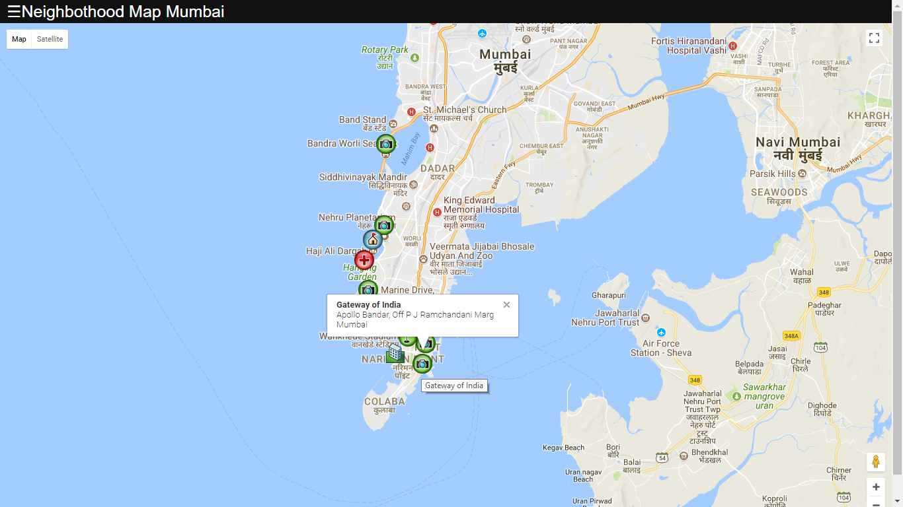
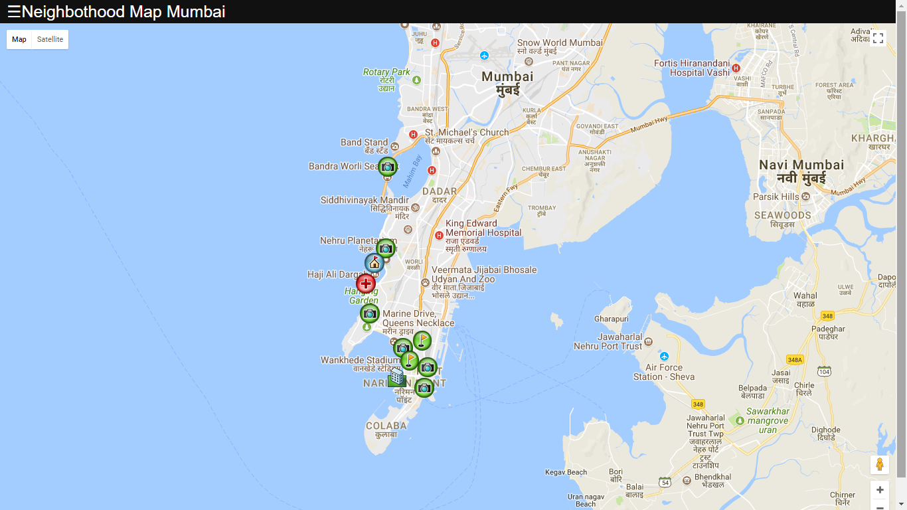
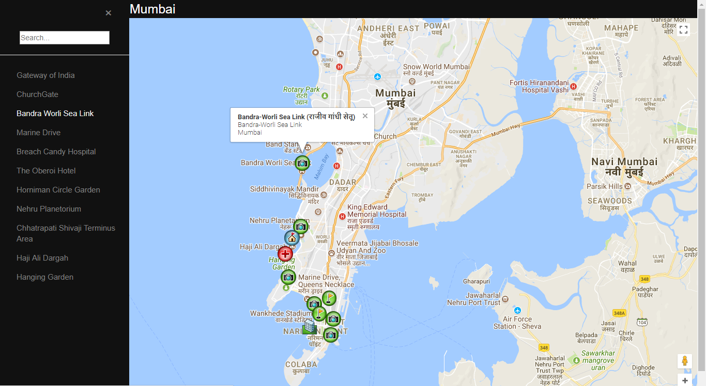

# Neighborhood Map Web Application

## About App
* It is a single page web application which displays neighborhood map of Mumbai city, India
* The app shows neighborhood area with different marker icons on the map
* User can search the locations using left pane menu search box
* selecting the marker with also show brief info about the location

## How to load the app
* Download all the files of the project in your local machine
* Open index.html file in any browser

## Screenshots

